# Create SSH keys and connect to the instance

## Introduction

The SSH (Secure Shell) protocol is a method for secure remote login from one computer to another. SSH enables secure system administration and file transfers over insecure networks using encryption to secure the connections between endpoints. SSH keys are an important part of securely accessing Oracle Cloud Infrastructure compute instances in the cloud.


*IMPORTANT:  If the SSH key is not created correctly, you will not be able to connect to your environment and will get errors.  Please ensure you create your key properly.*

Estimated Time: 5 minutes

### Objectives
- Generate and access SSH public and private keys
- Connect to the instance with SSH
- Setup SSH port forwarding

## Task 1a: SSH creation - MacOS

1.  If you don't already have a shortcut to the terminal application for MacOS, you can find it in the **Applications** > **Utilities** menu or (Shift+Command+U) on your keyboard.

2.  Start up **Terminal** and type in the command ```ssh-keygen```. ssh-keygen will ask you where to save the key, accept the default of the .ssh folder in your home directory by pressing Enter. The file name will be ```id_rsa``` or whatever you choose to name your key. Press Enter twice for no passphrase. Remember the directory where you saved your key (~/.ssh), you will need to reference it later when you create your instance.

    ````
    <copy>ssh-keygen</copy>
    ````

    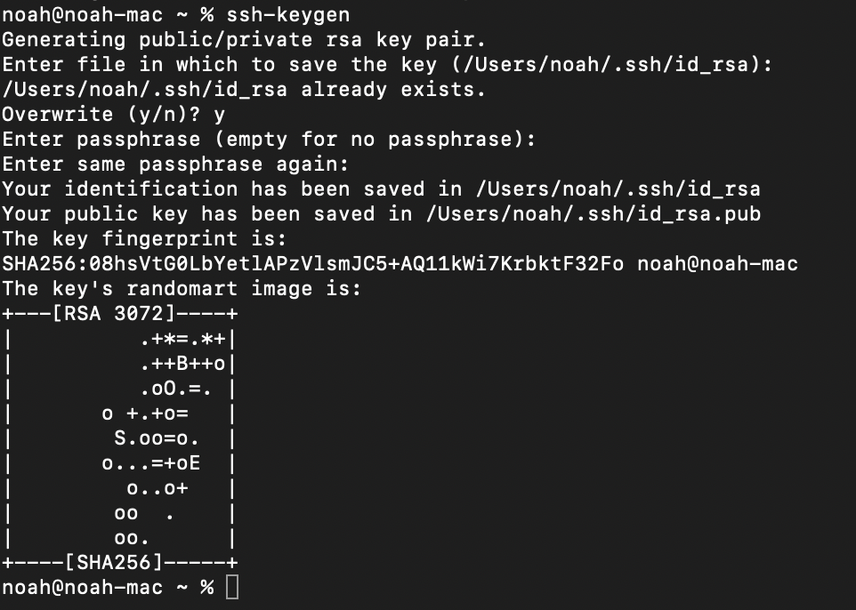


3.  Type the following commands in the terminal window to verify that the public and private keys were created.  Copy the contents of the public key and put in a notepad for later use.

    ```text
    <copy>cd .ssh</copy>
    ```

    ```
    <copy>ls</copy>
    ```

    ```text
    <copy>cat id_rsa.pub</copy>
    ```

    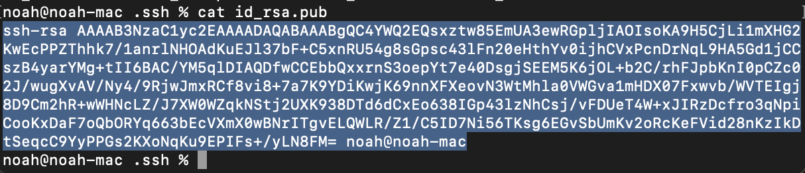

    >**Note:** In the output there are two files, a *private key:* ```id_rsa``` and a *public key:* ```id_rsa.pub```. Keep the private key safe and don't share its content with anyone. The public key will be needed for various activities and can be uploaded to certain systems as well as copied and pasted to facilitate secure communications in the cloud.


[Click for the MacOS Terminal User Guide](https://support.apple.com/guide/terminal/welcome/mac)


## Task 1b: SSH creation with PuTTY - Windows

In earlier versions of Windows, ssh-keygen was not a native utility, so third-party utilities had to be utilized. In this section, we'll illustrate using **PuTTY**. 

1.  If you don't already have it installed, access the link below and download the application.

    [Click here to download PuTTY for Windows](https://www.chiark.greenend.org.uk/~sgtatham/putty/latest.html)

2.  Follow the instructions for installation.
    >**Note:** Installing PuTTY is beyond the scope of this lab document.

    Once installed, you should have an entry in your Windows Start menu, and perhaps a desktop shortcut for PuTTY. PuTTY is actually a suite of secure communication utilities. We'll be using two of them, the PuTTY utility for terminal access and the PuTTYgen utility for generating a secure SSH key.

3.  Open the Windows start menu and navigate to the PuTTY folder. Select the PuTTYgen utility.

    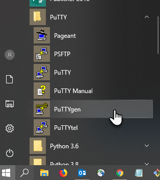

4.  Verify that the defaults are selected and the key type should be RSA set at 2048 bits.   Click on the **Generate** button.

    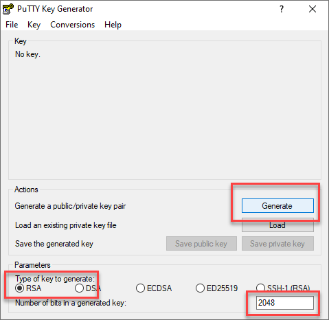

5.  Follow the instructions and move your mouse around the empty grey area to generate random information. PuTTY is using that information to generate a random, secure SSH key.

    

6.  In the below screen, PuTTY has taken your mouse information and created a key. We need to do several things here that are a little different than other key generation methods. Although we can't actually use the file for an OCI Instance, we'll still want to save the key for future reference. Click the **Save public key** button.

    >**Note:** PuTTY does not save keys in an OpenSSH-compatible format. Thus, if you upload a public key file created with PuTTY to a Linux/Unix system using OpenSSH, the key will not be read correctly. However, the key information itself, when copied directly from the PuTTYgen application, does work correctly when **pasted** into fields that then use that information to create a proper OpenSSH-compatible key. For example, when creating an instance on OCI, you can **paste** the SSH key from PuTTY and it will work correctly.

    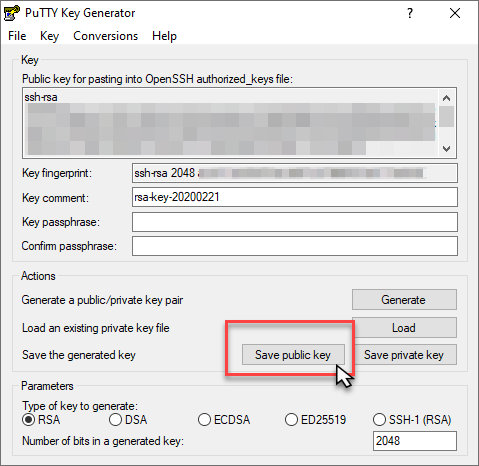

7.  In the *Save public key as:* dialog, name your key *id_rsa* and add the ```.pub``` extension to the filename. It will also be helpful if you save the file in the common ```.ssh``` folder under your Windows username/folder structure. In this example the key files will be accessible ```C:\Users\<username>\.ssh``` directory. Store the keys here for easy future reference.

8.  Next you will need to save the private key. Click the **Save private key** button, and answer **Yes** to the warning about saving without a passphrase.

    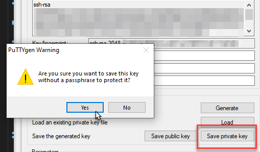

9.  Name the key and verify that it's saved with a ```.ppk``` extension to identify the file as the private key file. Do not share your private key with anyone.

    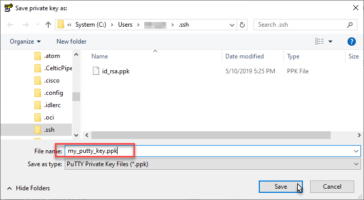

10. Now you've saved the keys for future reference, all you have to do is copy the public key information from the PuTTY dialog.

11. Select the key text in the dialog box from start to finish, then right-click and choose **Copy**. You can then paste the key into a Notepad.

    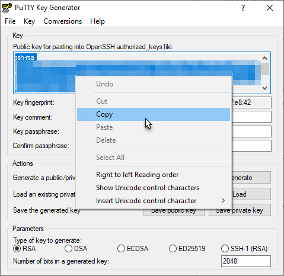

    This concludes the section on using PuTTY to generate a SSH key pair for Windows 10.

    Follow the below instructions to connect to a cloud instance via SSH using the PuTTY terminal.


## Task 2: Setup SSH connectivity


>**Note:** In this section you are enabling SSH access to the OS user running the remote desktop. This could be oracle, opc, or any other OS user for which the noVNC remote desktop has been configured.

This assumes that you already have an RSA-type SSH key-pair available on the local system where you will be connecting from. If not please refer to the previous step.

1. Open the remote clipboard on the remote desktop and launch a terminal session

    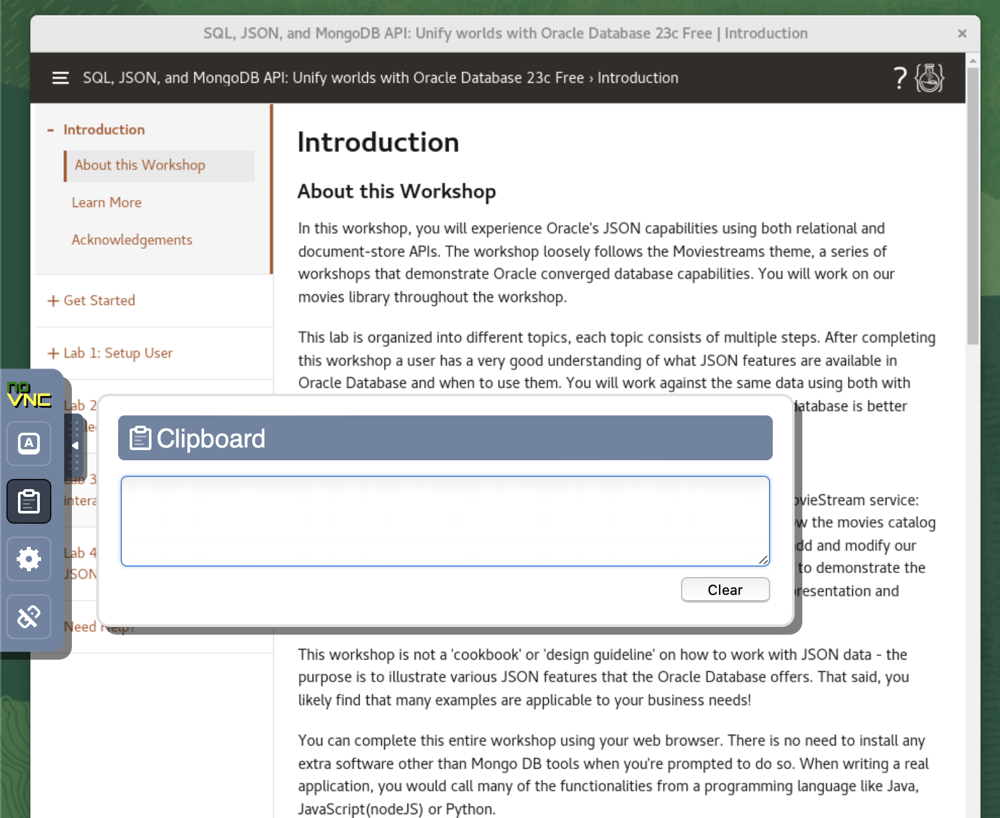

2. Paste the block below onto the remote clipboard first, then onto the terminal to create or update the file *$HOME/.ssh/authorized_keys* with the *Vi* editor

    ```text
    <copy>
    cd $HOME; mkdir .ssh; cd .ssh
    vi authorized_keys
    </copy>
    ```
    
    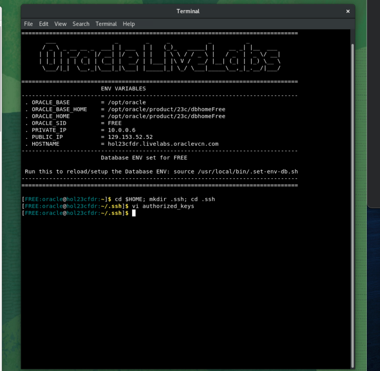

3. From your local system (e.g. your laptop) copy the public SSH key which was saved in your notepad in the previous step.


    


    

4. Paste the copied public key onto the remote clipboard first, then onto the terminal where you opened *authorized_keys* for edit

    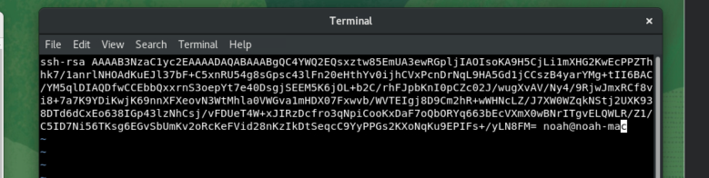

5. Save and exit the *Vi* editor by using the following commands: 
	
	press:
	
	```
	ESC followed by :
	```
	write:
	
	```
	wq!
	```
	press:
	
	```
	ENTER
	```

6. Set required permissions on *$HOME/.ssh* and *authorized_keys* by writing the following command in the terminal

    ```
    <copy>
    chmod 0700 $HOME/.ssh
    chmod 0600 $HOME/.ssh/authorized_keys
    </copy>
    ```
        
 
## Task 3a: Setup SSH tunnel - MacOS
The following steps are meant for anyone running this workshop on MacOS.

### **Setup**
1.  Open up a terminal on your local machine

2.  As the oracle user, establish an SSH session with port forwarding option between the local port and the destination port: 8080. The destination public IP adres can be found in the livelab enviorement.

    ````
    ssh -i ~/.ssh/<ssh-private-key> -L <local-port>:localhost:<remote-port> oracle@<destination public IP address>
    ````

    ````
    e.g
    <copy>ssh -i .ssh/id_rsa -L 8080:localhost:8080 oracle@188.111.88.222</copy>
    ````


    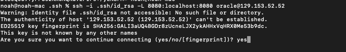
    
3. Write "yes", if succesful you should get this screen.

    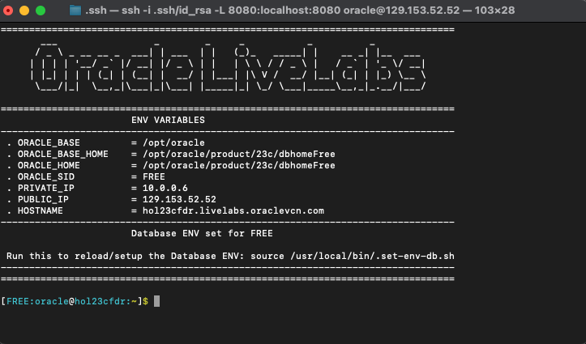
4. Continue to next lab. "Setup user"

  ***Note:***
   - For simplicity keep the local and destination ports identical, unless already used or unavailable on your local computer
   - This SSH session must remain alive throughout your connectivity to above remote port.
   - Steps (1)-(2) must be performed for each remote port needed

## Task 3b: Setup SSH tunnel - Windows
The following steps are meant for anyone running this workshop on Windows and use *PuTTY* utility as your SSH Client. If you are on MacOS, Unix/Linux, or Windows with Unix/Linux emulators such as Cygwin, MobaXterm, Exceed, and other similar utilities, please go back to the prior step.

### **Setup**
1. Launch Putty and Select or enter the following information:
    - Category: _Session_
    - IP address: _Your service instance’s public IP address_
    - Port: _22_
    - Connection type: _SSH_
    - Saved Sessions: "_Friendly Name to save your config_". e.g _SSH-Port-Forwarding-remote-port_

  

2. Navigate to "***Connection >> SSH >> Auth >> Tunnels***" and fill in the details as shown below and click **Add**
    - Source Port: Your application port. 8080
    - Destination: "_localhost:remote application port_" e.g. _localhost:8080_

  

3. Click **Add**

  

4. Navigate to "***Connection >> Data >> Auth >> Tunnels***" and add *oracle* as auto-login username  

  

5. Navigate to "***Connection >> SSH >> Auth***", click ***Browse***, and select your Private SSH key in *.ppk* format

  

6. Save your configuration

  

7. Click ***Open*** to start your session

  

 ***Note:***
   - For simplicity keep the local and destination ports identical, unless already used or unavailable on your local computer (e.g. 8080/8080)
   - This SSH session must remain alive throughout your connectivity to above remote port.
   - Steps (1)-(2) must be performed for each remote port needed


## Acknowledgements
* **Author** - Rene Fontcha, LiveLabs Platform Lead, NA Technology
* **Contributors** - Arabella Yao, Product Manager, Database Product Management
* **Last Updated By/Date** - Arabella Yao, Dec 2022